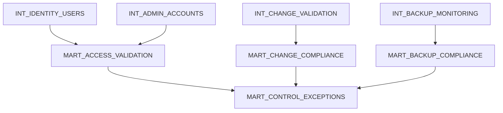
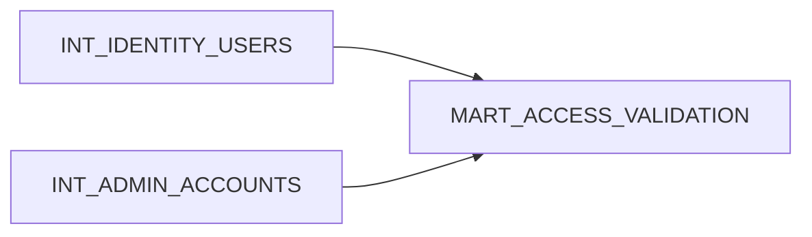
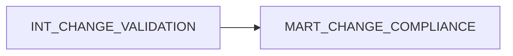
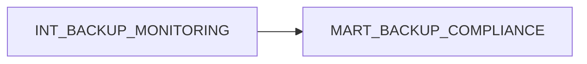
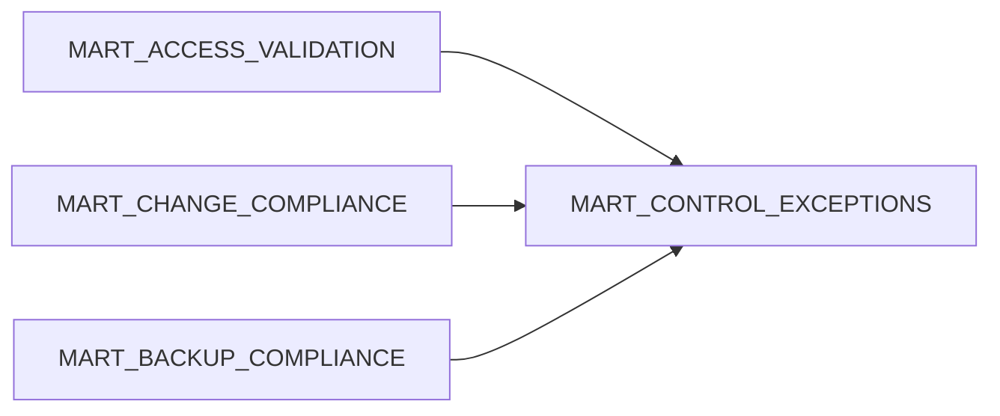

# Gold Layer – Compliance Reporting & ITGC Monitoring

## Overview

The Gold layer represents the **business and compliance reporting layer** of the Enterprise ITGC Monitoring platform.

While the Bronze layer captures raw operational logs and the Silver layer standardizes and prepares datasets, the Gold layer transforms those datasets into **actionable security insights and compliance metrics**.

This layer implements automated monitoring of **IT General Controls (ITGC)** and produces datasets that allow organizations to evaluate whether security controls are **operating effectively**.

The outputs of the Gold layer are designed to support:

* security monitoring
* compliance reporting
* audit evidence generation
* operational dashboards
* risk management

---

# Role of the Gold Layer in the Medallion Architecture

The platform follows a medallion architecture pattern.

Bronze → Raw log ingestion and evidence preservation
Silver → Data cleansing, normalization, and correlation
Gold → Security monitoring, control validation, and compliance reporting

The Gold layer converts **technical event data into meaningful security control outcomes**.

---

# Gold Layer Data Lineage Overview

The Gold layer consumes curated datasets from the Silver layer to evaluate control effectiveness and generate monitoring outputs.

This lineage ensures that all compliance outcomes can be traced back to **standardized operational datasets**.

---

# Security Perspective

## Risk Mitigation

The primary objective of the Gold layer is to **identify security risks and control failures**.

Security risks addressed in this layer include:

Unauthorized access
Privileged account misuse
Unauthorized system changes
Backup failures or missing backups

By continuously evaluating these conditions, the platform enables early detection of security issues before they escalate into incidents.

---

## Demonstrating ITGC Effectiveness

IT General Controls are considered **“Operating Effectively”** when they consistently enforce organizational security policies.

The Gold layer supports this evaluation by producing measurable outcomes such as:

* number of compliant vs non-compliant events
* frequency of control violations
* remediation timelines
* control exception trends

For example:

Access Control Validation

Admin accounts must correspond to valid employees.

The monitoring logic checks whether:

* privileged accounts exist without HR employee mapping
* employees who left the organization still retain system access

If no violations are detected, the control can be considered **operating effectively**.

---

## Continuous Compliance Monitoring

Traditional ITGC audits often rely on **periodic manual testing**.

This platform introduces **continuous control monitoring**, allowing organizations to:

* detect control violations in near real time
* identify emerging risks
* improve operational security posture

The Gold layer therefore acts as a **continuous compliance monitoring system**.

---

# Data Engineering Perspective

## Aggregations for Security Analytics

The Gold layer performs aggregations that transform operational events into meaningful metrics.

Examples include:

* number of privileged accounts per system
* deployments executed without approved change tickets
* failed or incomplete backup operations
* frequency of control violations over time

Aggregations allow security teams and auditors to quickly understand **overall control performance** rather than reviewing individual log events.

---

## Analytical Data Modeling

Gold layer datasets are structured for **analytics and reporting workloads**.

Design principles include:

* simplified schema for easier querying
* clear business-oriented column names
* pre-computed metrics
* summarized compliance indicators

These design decisions enable downstream tools such as dashboards and reporting platforms to query the data efficiently.

---

## Performance Optimization

Because Gold layer tables are frequently accessed by reporting tools, performance optimization is important.

Typical optimization strategies include:

Pre-aggregated datasets
Reducing query complexity for dashboards

Efficient table structures
Designing tables optimized for analytical queries

Partitioning and clustering
Ensuring queries scan only relevant data ranges

Minimizing expensive joins
Most joins are already resolved in the Silver layer

These practices ensure that dashboards and compliance reports can run **quickly and efficiently**.

---

# Gold Layer Models

The following models represent key compliance monitoring outputs.

---

# Model: mart_access_validation

Purpose

Validates whether privileged access assignments comply with access governance policies.

Data Lineage

Key Metrics

* total privileged accounts
* privileged accounts mapped to employees
* orphaned privileged accounts
* inactive employees with active system access

Security Value

Supports monitoring for **unauthorized or unmanaged privileged access**.

---

# Model: mart_change_compliance

Purpose

Validates whether system deployments follow the organization's change management process.

Data Lineage

Key Metrics

* deployments with approved change requests
* deployments without change approvals
* deployment frequency
* change approval compliance rate

Security Value

Detects **unauthorized system modifications**.

---

# Model: mart_backup_compliance

Purpose

Monitors operational backup reliability.

Data Lineage

Key Metrics

* successful backup jobs
* failed backup executions
* missing backup schedules
* backup success rate

Security Value

Ensures **data recoverability and operational resilience**.

---

# Model: mart_control_exceptions

Purpose

Centralized dataset that records all detected control violations.

Data Lineage

Each record represents a **control exception requiring investigation or remediation**.

Example attributes:

* control_id
* domain
* severity
* finding_detail
* days_open
* remediation_sla_days

Security Value

Provides a consolidated view of **all ITGC failures across the environment**.

---

# Business Insights Derived from the Gold Layer

The Gold layer provides several valuable insights for security teams and auditors.

Examples include:

Control Effectiveness Metrics

Determine whether security controls are functioning as intended.

Access Governance Insights

Identify unauthorized or excessive privileged access.

Change Management Compliance

Track deployments that bypass approved change processes.

Operational Resilience Monitoring

Detect backup failures that could lead to data loss.

Exception Management

Track open control violations and remediation timelines.

Audit Evidence

Provide structured evidence supporting ITGC compliance.

---

# Dashboard and Reporting Use Cases

Gold layer datasets can power multiple dashboards.

Examples include:

ITGC Compliance Dashboard

Shows compliance status of critical controls.

Access Governance Dashboard

Displays privileged account monitoring metrics.

Change Management Dashboard

Highlights unauthorized deployments.

Backup Reliability Dashboard

Tracks backup success rates and failures.

Control Exception Dashboard

Shows open security findings and SLA breaches.

---

# Key Takeaways

The Gold layer converts operational log data into **actionable security intelligence and compliance metrics**.

Security Objectives

* detect security risks early
* evaluate ITGC effectiveness
* support continuous compliance monitoring
* provide evidence for audits and investigations

Data Engineering Objectives

* create analytics-ready datasets
* optimize queries for dashboards and reporting
* aggregate large operational datasets into meaningful metrics
* provide scalable and performant reporting tables

By combining **security governance principles with scalable data engineering design**, the Gold layer enables organizations to continuously monitor and validate **IT General Controls at scale**.
