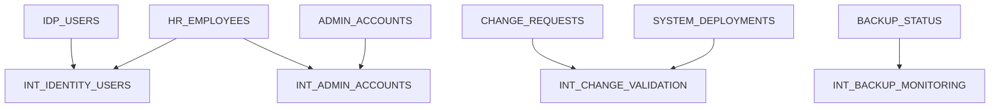
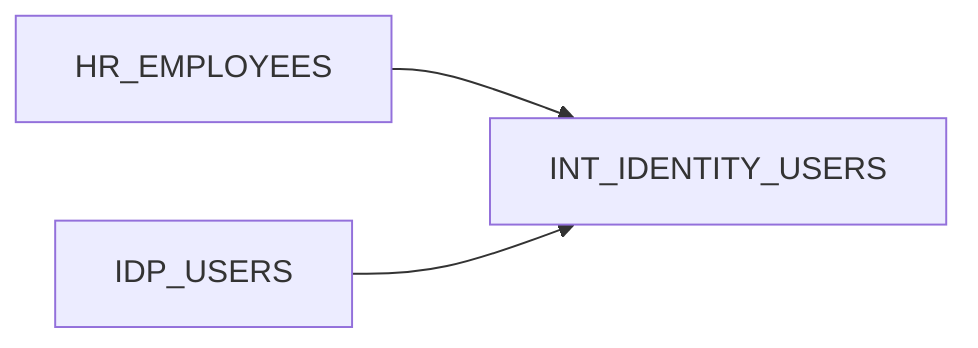
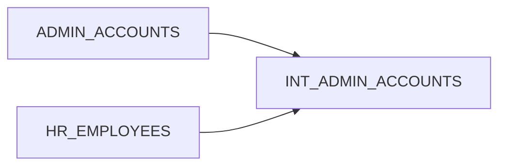
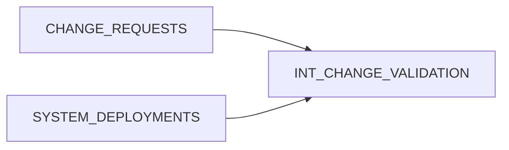
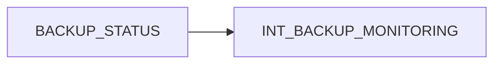

# Silver Layer – Data Cleansing, Normalization & Control Logic Preparation

## Overview

The Silver layer represents the **data standardization and transformation layer** of the Enterprise ITGC Monitoring platform.

While the Bronze layer focuses on preserving raw operational logs, the Silver layer transforms those logs into **clean, structured, and consistent datasets** suitable for security analytics and automated control validation.

At this stage, the pipeline applies controlled transformations to improve **data quality, consistency, and analytical usability**, while maintaining traceability back to the original raw records.

The datasets produced in this layer are used by the **Gold layer to implement automated IT General Controls (ITGC) monitoring and exception detection**.

---

# Role of the Silver Layer in the Medallion Architecture

The platform follows a **medallion data architecture**.

Bronze → Raw log ingestion and evidence preservation
Silver → Data cleansing, normalization, and correlation
Gold → Control validation and security monitoring

The Silver layer ensures that downstream control logic operates on **high-quality and reliable datasets**.

---

# Silver Layer Data Lineage Overview

The following diagram illustrates how Bronze layer datasets are transformed into standardized intermediate models.

This lineage ensures that security controls can be evaluated using **clean and correlated datasets derived from multiple operational systems**.

---

# Security Perspective

## Preparing Data for Control Validation

Security monitoring requires correlating data from multiple systems.

Raw logs alone are insufficient because:

* identifiers may not match across systems
* timestamps may be inconsistent
* duplicate records may exist
* incomplete records may appear

The Silver layer prepares datasets that enable reliable security monitoring by:

* aligning identities across systems
* normalizing event timestamps
* ensuring consistent identifiers
* filtering unusable records

These transformations ensure that control logic in the Gold layer operates on **trusted and consistent data**.

---

## Example Security Control Preparation

Security monitoring platforms often analyze authentication failures to detect brute-force attacks.

For example, Windows security logs generate **Event ID 4625** for failed login attempts.

Example detection logic:

* Filter authentication events for **Event ID 4625**
* Group events by user or source IP
* Detect spikes in failed login attempts

Although this project simulates enterprise log datasets, the Silver layer prepares security events so similar detection logic can be implemented in the monitoring layer.

---

## Identity Correlation Across Systems

Enterprise systems maintain identity data in different repositories.

Examples include:

* HR employee records
* Identity provider accounts
* Infrastructure privilege assignments

The Silver layer aligns these datasets to enable security monitoring scenarios such as:

* identifying orphaned user accounts
* validating privileged access assignments
* detecting inactive accounts

This correlation enables automated monitoring for **unauthorized or unmanaged access**.

---

# Data Engineering Perspective

## Data Normalization

Operational systems often produce data with inconsistent formats.

Normalization ensures that data from multiple sources can be reliably combined.

Normalization activities include:

* standardizing column naming conventions
* aligning identifier formats
* converting string timestamps into structured timestamp fields
* enforcing consistent primary keys

Example:

Different systems may represent employee identifiers differently.

HR System → EMP_1001
Identity Provider → 1001
Admin System → emp-1001

Normalization ensures these identifiers can be **joined across datasets consistently**.

---

## Data Deduplication

Operational logging pipelines may generate duplicate records due to:

* ingestion retries
* system restarts
* overlapping log exports

Duplicate records can cause:

* inaccurate event counts
* false security alerts
* misleading operational metrics

The Silver layer removes duplicates using techniques such as:

* identifying unique event identifiers
* selecting the most recent record based on timestamps
* removing exact duplicate rows

This ensures that monitoring logic operates on **accurate event counts**.

---

## Handling Null and Missing Values

Log datasets frequently contain missing values such as:

* missing user identifiers
* incomplete timestamps
* undefined status values

The Silver layer applies controlled strategies to handle such cases:

* replacing null values with standardized placeholders when appropriate
* filtering records that cannot be reliably interpreted
* preserving traceability to raw records

These steps prevent incomplete data from affecting control detection logic.

---

## Timestamp Standardization

Operational logs often originate from systems operating in different time zones.

Examples include:

* UTC timestamps from cloud services
* local server time from on-premise systems
* ISO timestamp formats from APIs

Without normalization, event timelines may appear inconsistent.

The Silver layer standardizes timestamps by:

* converting timestamps to a unified format
* normalizing timestamps to **UTC**
* preserving original timestamps where necessary

This ensures accurate reconstruction of event sequences during security analysis.

---

# Intermediate Models

The following intermediate models prepare datasets used for ITGC monitoring.

---

# Model: int_identity_users

Purpose
Standardizes identity information across HR and identity provider datasets.

Data Lineage

Key Transformations

* normalize employee identifiers
* align identity attributes
* standardize timestamp formats
* remove duplicate user records

Security Value

This model enables detection of:

* orphaned user accounts
* inactive employees with active accounts
* identity inconsistencies across systems

---

# Model: int_admin_accounts

Purpose
Prepares privileged account datasets used for monitoring administrative access.

Data Lineage

Key Transformations

* normalize administrator account identifiers
* map privileged accounts to employee records
* remove duplicate admin account entries

Security Value

Supports detection of:

* privileged accounts without employee mapping
* excessive administrative privileges
* unauthorized privileged identities

---

# Model: int_change_validation

Purpose
Prepares datasets required to validate production deployments against approved change requests.

Data Lineage

Key Transformations

* normalize change ticket identifiers
* align deployment timestamps
* remove duplicate deployment records
* standardize deployment status fields

Security Value

Enables detection of:

* deployments without approved change tickets
* unauthorized system changes
* change management policy violations

---

# Model: int_backup_monitoring

Purpose
Standardizes backup job records for reliability monitoring.

Data Lineage

Key Transformations

* normalize backup status values
* standardize job timestamps
* filter incomplete records

Security Value

Supports monitoring of:

* failed backup jobs
* missing backup executions
* backup SLA violations

---

# Key Takeaways

The Silver layer bridges the gap between **raw operational logs and actionable security intelligence**.

Security Objectives

* prepare datasets for automated control validation
* enable correlation between identity, access, and operational events
* support detection of security anomalies

Data Engineering Objectives

* normalize data structures across systems
* remove duplicate records
* handle null values and incomplete data
* standardize timestamps across multiple time zones

By combining **security monitoring logic with strong data engineering practices**, the Silver layer ensures that the ITGC monitoring platform operates on **clean, consistent, and trustworthy datasets**.
